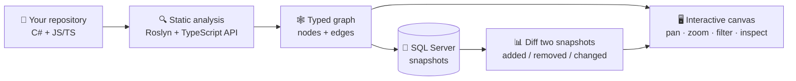
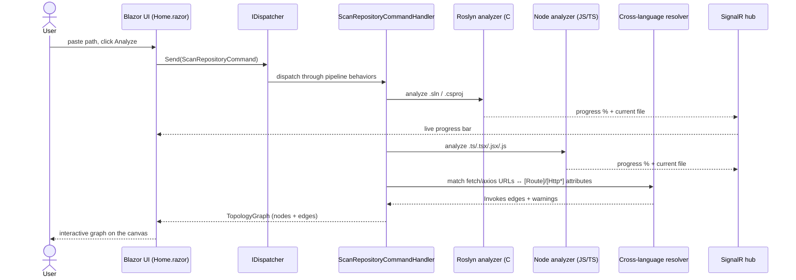
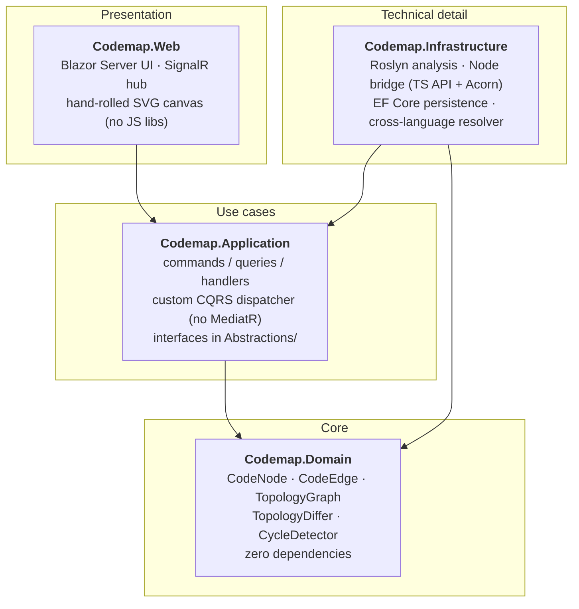
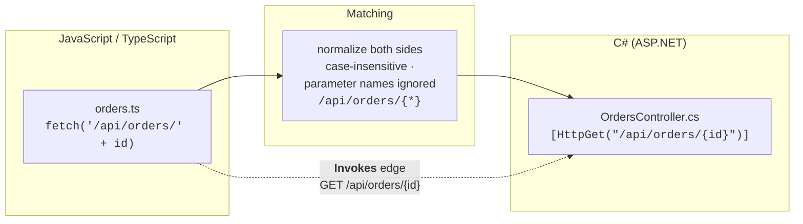

# Codemap — Code Structure & Relationship Analyzer

[](https://dotnet.microsoft.com/)
[](https://learn.microsoft.com/aspnet/core/blazor/)
[](LICENSE)

Codemap statically analyzes **C# solutions** and **JavaScript/TypeScript projects** and renders an
interactive dependency graph: classes, interfaces, enums, structs, functions and modules as nodes;
inheritance, implementation, calls, references and **cross-language HTTP invocations** as typed
edges. Graph snapshots persist to SQL Server so topologies can be diffed over time, git-style.

## The idea in one picture

Point Codemap at a repository. It reads the code (it never runs it), builds a typed graph of
everything it finds, and shows it on a pannable/zoomable canvas — including the edges that
normally stay invisible: the `fetch('/api/orders')` in your frontend that lands on
`OrdersController` in your backend.



**What the graph contains:**

| Element | Meaning | Example |
|---|---|---|
| Node | Class, interface, enum, struct, JS/TS module or function | `OrderService`, `api/client.ts` |
| `Inherits` edge | Class inheritance | `AdminUser → User` |
| `Implements` edge | Interface implementation | `EfGraphRepository → IGraphRepository` |
| `Calls` edge | Method/function invocation | `OrderService → EmailSender` |
| `References` edge | Member types, imports, cross-module use | `import { api } from './client'` |
| `Invokes` edge | **Cross-language HTTP call** | JS `fetch('/api/scan')` → C# `[HttpPost("/api/scan")]` |

## How a scan works

1. Paste a path to a repo / `.sln` / project folder and hit **Analyze** (or `Ctrl+Enter`).
2. The C# engine (Roslyn) and the JS/TS engine (a bundled Node script) walk the code and emit
   nodes and edges; progress streams live to the browser over SignalR.
3. The cross-language resolver matches JS HTTP call sites against ASP.NET route attributes and
   adds `Invokes` edges.
4. The finished graph appears on the canvas. **Publish snapshot** persists it; **History** lets
   you diff any two snapshots, with additions/removals/changes highlighted on the canvas.



## Architecture (Clean Architecture, 4 projects)



Dependency direction: `Web → Application → Domain`; `Infrastructure → Application → Domain`.
Every use case is dispatched through the custom `IDispatcher` (no MediatR) — `Codemap.Web` never
calls a service directly. `Application` owns the interfaces; `Infrastructure` implements them.

```
src/Codemap.Domain           entities, value objects, enums, pure graph algorithms — no dependencies
src/Codemap.Application      commands/queries + handlers, custom CQRS dispatcher, infrastructure interfaces
src/Codemap.Infrastructure   Roslyn analysis, JS/TS analysis (Node bridge), EF Core persistence,
                             cross-language edge resolver
src/Codemap.Web              Blazor Server UI, SignalR scan-progress hub
tests/Codemap.Tests          xUnit tests for all layers
```

## Cross-language edges — the special sauce

Codemap connects a frontend to its backend by matching HTTP call sites to route attributes:



`fetch`/`axios`/`$http` call sites with literal (or simple template) URLs are matched against
`[Route]`/`[Http*]` attributes by normalized route pattern; unmatched calls surface as scan
warnings instead of silently disappearing.

## Prerequisites

- **.NET 10 SDK** (MSBuildLocator loads MSBuild from the installed SDK to open target solutions)
- **SQL Server** — defaults to `(localdb)\MSSQLLocalDB` (see `ConnectionStrings:Codemap` in
  `src/Codemap.Web/appsettings.json`). If the database is unreachable the app still runs; scans
  stay in memory and only publish/history features are disabled.
- **Node.js** — only needed for JS/TS analysis. On first JS scan, Codemap runs `npm install`
  inside the bundled analyzer script folder (`typescript`, `acorn`); without Node the C# side
  still works and the scan reports a warning.

## Run

```bash
dotnet run --project src/Codemap.Web
```

Open the app, paste a path to a repository / `.sln` / project folder, hit **Analyze**
(or `Ctrl+Enter`). Progress streams live over SignalR. **Publish snapshot** persists the scan;
**History** lists snapshots, recent scans, and diffs two snapshots (added/removed/changed nodes
and edges, highlighted on the canvas).

Database schema is created automatically at startup via EF Core migrations. To add migrations:

```bash
dotnet dotnet-ef migrations add <Name> --project src/Codemap.Infrastructure --startup-project src/Codemap.Web --output-dir Persistence/Migrations
```

## Keyboard shortcuts

`?` shows the in-app cheat-sheet. Highlights:

| Shortcut | Action |
|---|---|
| `Ctrl/⌘ + K` | Quick-jump to any node |
| `Ctrl/⌘ + Enter` | Analyze |
| `1` / `2` / `3` | Language filter (All / C# / JS) |
| `F` | Zoom to fit |
| `+` / `-` | Zoom in / out |
| Arrow keys | Nudge selected node (`Shift` = 10 px) |
| `Ctrl/⌘ + F` | Focus the namespace filter |
| `Esc` | Clear selection / close panels |

## How analysis works (details)

- **C#** — `MSBuildWorkspace` loads solutions/projects; `SymbolWalker` (SyntaxWalker +
  SemanticModel) emits nodes, member signatures, and ASP.NET route attributes;
  `CallGraphBuilder` resolves invocations/base lists/member types into
  `Calls`/`Inherits`/`Implements`/`References` edges. Edges point at open generic definitions;
  partial classes collapse into one node; cross-project references resolve within a solution.
- **JS/TS** — a bundled Node script (invoked via `Jering.Javascript.NodeJS`) uses the TypeScript
  Compiler API for `.ts`/`.tsx`/`.jsx` and Acorn for plain `.js`. Modules, classes and top-level
  functions become nodes; imports become `References`; same-module calls become `Calls`,
  cross-module calls degrade to lower-confidence `References`.
- **Cross-language** — `fetch`/`axios`/`$http` call sites with literal (or simple template) URLs
  are matched against `[Route]`/`[Http*]` attributes by normalized route pattern
  (case-insensitive, parameter names ignored) and emit `Invokes` edges; unmatched calls surface
  as scan warnings.

## Tests

```bash
dotnet test
```

Covers `SymbolWalker` node/endpoint extraction, `CallGraphBuilder` edge extraction (inheritance,
implements, calls, references, open generics), cross-language route matching, the dispatcher
(handler resolution, behavior ordering, notification fan-out), topology diffing, cycle detection,
and the keyboard shortcut mapping.

## License

Codemap is released under the [MIT License](LICENSE).
